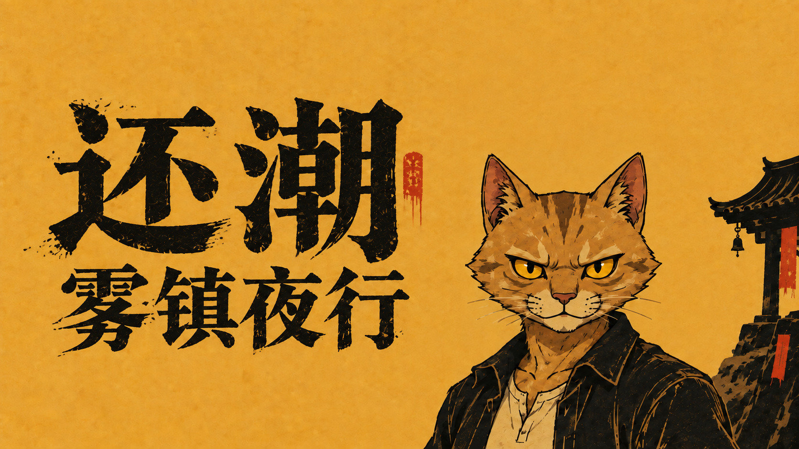

# 还潮-雾镇夜行

**做一只夜行的黄猫，在雾镇里活下去。**

《还潮-雾镇夜行》是一款三维生存动作游戏。带着法器穿过街巷，跃上屋顶，在追来的异物之间寻找出路；一边拾取灵萤成长，一边迎战雾镇里的首领。

**[立即下载 Windows 版](https://github.com/sparklecatta-lang/Huanchao-Nightwalk/releases/latest)** · **[查看本次更新](https://github.com/sparklecatta-lang/Huanchao-Nightwalk/releases/tag/v0.43.0)**

## 开始夜行

1. 打开上方下载页，下载 `Huanchao-Nightwalk-v0.43.0-Windows-x64.zip`。

2. 将压缩包完整解压到电脑上的文件夹。

3. 打开解压后的文件夹，双击 `HuanchaoReborn.exe` 开始游戏。

支持 Windows 64 位，无需安装 Unity 编辑器。请保留程序旁的 `HuanchaoReborn_Data` 文件夹及其他运行文件。

## 操作说明

法器会自动攻击。下面的手柄按键采用 Xbox / XInput 布局。

### 战斗与移动

| 操作 | 键鼠 | 手柄 |

| --- | --- | --- |

| 移动 | W / A / S / D | 左摇杆 |

| 转动视角 | 移动鼠标 | 右摇杆 |

| 跳跃、二段跳 | 空格；离地后再次按空格 | A；离地后再次按 A |

| 冲刺闪避 | 左 Shift | B |

| 地面主动攻击 | Q | X |

| 空中下砸 | 跃起达到一定高度后按 Q | 跃起达到一定高度后按 X |

| 与附近目标交互 | E | Y |

| 暂停、继续 | Esc | Start / Menu 或 Back / View |

**弹反**：在地面面向飞来的敌方投射物，在它接近时按 **Q / X** 发动主动攻击；攻击过程中有短暂弹反窗口，成功后会显示《还潮》DLC 的弹反闪光，并响起清脆提示音。反弹投射物伤害为原伤害的 **2 倍**，会穿透沿途敌人，每个目标只命中一次，飞行结束或碰到障碍物后消失。冲刺也有短暂无敌，可用于闪避。

**探索交互**：靠近宝箱、陶罐或可交互的首领点后按 **E / Y**。开箱需要足够铜钱，陶罐免费；祈愿点需要站在范围内充能。箱罐的奖励会按各自规则发放，陶罐掉落物先飞出再被吸收。

### 菜单与升级

| 操作 | 键鼠 | 手柄 |

| --- | --- | --- |

| 移动菜单焦点 | 方向键或 W / A / S / D，也可移动鼠标 | 左摇杆或十字键 |

| 确认菜单选项 | 回车或鼠标左键点击 | A |

| 关闭设置、图鉴或地图 | Esc | B |

| 选择升级卡片 | 数字 1 / 2 / 3，或点击对应卡片 | 移动焦点后按 A |

| 重抽升级选项 | R，或点击重抽按钮 | 选中重抽按钮后按 A |

重抽需要满足界面显示的条件。升级选择不能用返回键直接跳过；在暂停界面按 B 可继续游戏。

### 其他键盘操作

| 操作 | 按键 |

| --- | --- |

| 打开、关闭大地图 | Tab；打开后也可按 Esc 或手柄 B 关闭 |

| 调整镜头远近 | 鼠标滚轮 |

| 释放鼠标、查看界面 | 按住左 Alt 或右 Alt |

| 滑行 | 移动时按住左 Ctrl |

| 切换全屏、窗口 | F11 |

大地图、滑行、镜头远近和全屏切换目前没有专用手柄按键。音乐和音效音量可以在设置中分别调整。标题界面的“操作说明”也可随时打开查阅。

## 雾镇里有什么

- **移动与反击**：用跳跃、冲刺和主动攻击穿过包围，在合适的时机把敌方投射物弹回去。

- **法器与成长**：16 种自动攻击武器，最多同时携带 4 件；升级时三选一，组合自己的战斗方式。

- **街巷与高处**：探索街道、屋顶和山地，寻找宝箱、补给与能够主动召唤的首领。

- **十分钟后的挑战**：夜行满十分钟，山君现身；击败全部首领，结束这一局夜行。

## 随身法器

  

飞符、月轮、桃木剑、镇魂铃、朱砂葫芦、引魂灯、棺钉、无字经、照骨镜、陨铁锤、镇风扇、油纸伞、铜钱、判官笔、饕餮牙、五雷令。

*配图使用游戏已有法器图集；顶部为基于游戏标题插画制作的封面。*

## 本次更新 · 0.43

| 内容 | 变化 |
| --- | --- |
| 操作说明 | 标题页新增操作说明入口，以按键图示和分组页面介绍键鼠、手柄与战斗操作 |
| 夜行录 | 分开展示累计成绩与历次记录，扩大记录区并支持手柄滚动 |
| 设置界面 | 按用途整理设置项目，强化选中状态和数值反馈 |
| 怪物图鉴 | 用十二幅黑墨毛笔画像替代模型待机展示，保留真实怪物资料 |
| 雾镇浓雾 | 拉近雾层起点、增强中远景雾气；街道和山地增加更宽的流动雾，主角近身留出清晰区域 |
| 首领音效优先 | 主角第一、BOSS 第二；为首领预备、出招、命中、受击和死亡保留播放位置与音量 |
| 密集战斗 | 不同首领同帧出招分别发声，远处首领技能不再被距离剔除；小怪不能挤掉首领声音 |
| 更多音效 | 从《还潮》已有录音中补入 23 段，分别接入七类首领及技能命中反馈 |
| 关键反馈 | 保留开箱、开罐与奖励反馈的专用位置；弹反继续使用此前指定的 Sekiro9 音效 |

## 历史更新 · 0.42

| 内容 | 变化 |

| --- | --- |

| 开箱与开罐 | 修正密集战斗、主角动作音同时播放时，交互声音被挤掉或压到零的问题 |

| 关键反馈 | 确认、升级、拾取、祈愿充能与完成奖励获得独立的保留音量和播放位置 |

| 连续交互 | 同类音效最多保留两层，新事件重启旧尾音；不同类型的关键声音互相保留 |

| 主角优先 | 主角仍使用最高播放优先级，同时为关键交互留下可用位置 |

| 首领技能音效 | 优先级高于小怪，主角音效仍为最高优先级 |

| 追踪雨伞 | 直径由 1.76 米扩大到 3 米，伞面朝上旋转，跟随地形保持离地距离 |

| 穿透弹反 | 伤害为原投射物的 2 倍，穿透沿途目标且各命中一次；击杀发射者后仍继续飞行 |

| 弹反特效 | 接入《还潮》DLC 原四层闪光，继续使用 Sekiro9 音效，近战音效不变 |

| 操作说明 | 补充当前键鼠与手柄按键、弹反、二段跳、地图和升级操作 |

## 历史更新 · 0.41

| 内容 | 变化 |

| --- | --- |

| 判官笔加粗 | 加宽笔迹并补齐转角连接，保留笔刷纹理、收尖尾部与贴地裁切 |

| 主角音效优先 | 冲刺、跳跃、受击、脚步、游泳、落地、治疗、主动近战与弹反使用最高播放优先级 |

| 密集战斗反馈 | 敌人和法器音效不能挤掉主角音效，也不会因为数量增加而压低主角反馈音量 |

| 连续动作 | 同类声音达到层数上限时重启旧尾音，让新动作的声音及时响起 |

| 水中冲刺 | 补齐成功冲刺时的音效 |

| 音量设置 | 保留音效滑块、静音和暂停控制，背景音乐音量保持稳定 |

## 历史更新 · 0.40

| 内容 | 变化 |

| --- | --- |

| 三名人形首领 | 调整镇街石将、巡更铜傀、纸嫁伞妖的行走动作 |

| 镇街石将 | 双拳触地后沿直线释放六连大型岩刺 |

| 巡更铜傀 | 移除手持武器，双手拍头钟；音波扩张、收缩各判定一次 |

| 纸嫁伞妖 | 投出追踪雨伞，可在接近时冲刺躲避或攻击弹回 |

| 弹反反馈 | 加入清脆的弹反音效，近战打击音效保持原样 |

| 精英敌人 | 普通刷怪中穿插精英，体型 2 倍，血量、攻击与奖励 3 倍 |

## 遇到问题

欢迎在[问题反馈](https://github.com/sparklecatta-lang/Huanchao-Nightwalk/issues)中描述遇到的情况，并注明游戏版本和复现步骤。

本仓库提供 Windows 可玩程序、更新说明与展示配图。当前发布版本为 **v0.43.0**。

